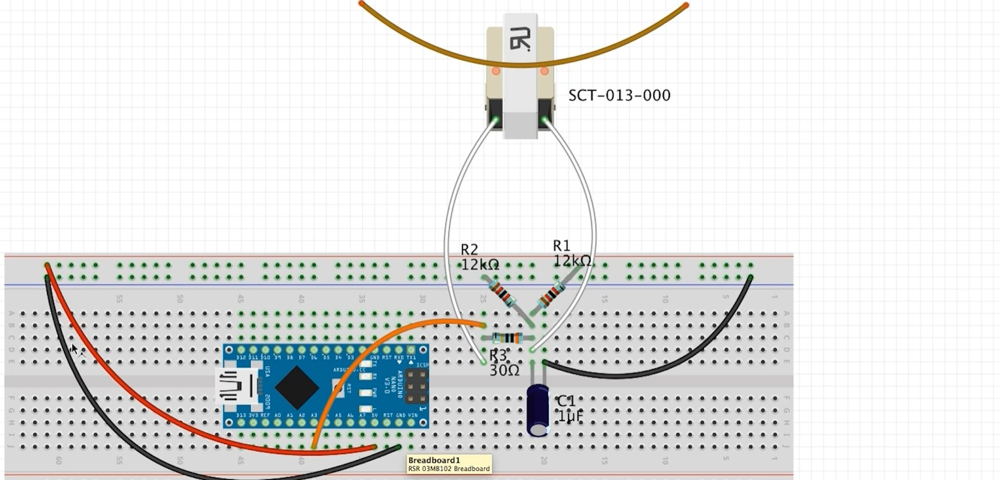

# RawDataWorker

> Arduino-based current-transformer data collector that publishes machine
> "working / idle" state to the **AWM** monitoring system over HTTP.

[]()
[]()
[](LICENSE)
[](https://github.com/Dimo4ka174/RawDataWorker/actions/workflows/build.yml)

---

## Overview

`RawDataWorker` is a small hardware agent that turns an ordinary
current transformer (CT) into a **non-invasive machine activity sensor**.
It measures the RMS current drawn by the machine's power line, decides
whether the machine is currently working or idle, and pushes the state
to the **AWM** backend via a plain HTTP `POST`.

The project is part of a larger monitoring stack:

```
┌──────────────┐   HTTP/JSON   ┌──────────────┐   SignalR   ┌────────────┐
│ RawDataWorker│ ────────────► │     AWM      │ ──────────► │  Dashboard │
│  (Arduino)   │               │  (ASP.NET)   │             │  (browser) │
└──────────────┘               └──────────────┘             └────────────┘
```

This repository contains **only the firmware and hardware artifacts**.
The backend lives in a separate repository.

---

## How it works

1. The current transformer is clamped onto one phase of the machine's
   power cable. It outputs a small AC voltage proportional to the line
   current.
2. The Arduino samples the CT via `EmonLib::calcIrms()` and computes
   the RMS current.
3. Estimated active power is `P ≈ U · I` (nominal 230 V).
4. A simple **debouncer** requires `N` consecutive equal readings before
   the state is considered stable.
5. When the stable state differs from the last state that was successfully
   sent, the Arduino opens a TCP connection to the AWM backend and issues:

   ```http
   POST /api/Wincc/updateMachineStatus HTTP/1.1
   Host: 192.168.10.200
   Content-Type: application/json
   Content-Length: 87
   Connection: close

   {"machineName":"Danobat","Condition":true,"current":3.42,"power":787}
   ```

6. The server replies `200 OK` with a body indicating whether the state
   was actually changed. The Arduino treats any `200 OK` as success.

---

## Hardware

| Component             | Notes                                                |
| --------------------- | ---------------------------------------------------- |
| Arduino Mega 2560     | Any AVR board with enough RAM will do                |
| Ethernet Shield W5100 | Or a compatible W5100/W5500 module                   |
| SCT-013-030 CT        | 30 A / 1 V output; adjust `CT_CALIBRATION` to taste  |
| Burden resistor       | Already built into the SCT-013-030                   |
| 3D-printed enclosure  | See [`hardware/case`](hardware/case)                 |

### Wiring



> ⚠️ The current transformer must be clamped **around a single phase
> conductor**, not around the whole cable. Otherwise the magnetic fields
> cancel out and you will read ~0 A.

Photos of the assembled device: [`hardware/photos`](hardware/photos).

---

## Firmware

### Dependencies

- [`EmonLib`](https://github.com/openenergymonitor/EmonLib) — current measurement
- `Ethernet` — W5100/W5500 networking
- `SPI` — bundled with the AVR core

### Build & flash

1. Open `firmware/RawDataWorker/RawDataWorker.ino` in the Arduino IDE.
2. Select **Tools → Board → Arduino Mega or Mega 2560**.
3. Select the correct serial port.
4. Adjust the configuration block at the top of the sketch
   (IP addresses, `MACHINE_NAME`, `CT_CALIBRATION`, …).
5. Upload and open the Serial Monitor at **9600 baud**.

### Configuration

All tunables live in a single block at the top of the sketch:

| Constant                 | Purpose                                              |
| ------------------------ | ---------------------------------------------------- |
| `mac`, `localIp`, …      | Static network configuration of the Arduino          |
| `serverIp`, `serverPort` | AWM backend address                                  |
| `MACHINE_NAME`           | Identifier sent in every payload                     |
| `CT_CALIBRATION`         | EmonLib calibration coefficient; tune to your CT     |
| `CURRENT_THRESHOLD_A`    | Current above which the machine is considered active |
| `MAINS_VOLTAGE_V`        | Nominal voltage used for the power estimate          |
| `NEED_STABLE_READINGS`   | Number of equal readings to confirm a state change   |
| `MEASURE_INTERVAL_MS`    | Sampling period                                      |
| `HTTP_TIMEOUT_MS`        | Socket timeout for the outgoing request              |

### Serial output example

```
========================================
===     RAW DATA WORKER (current)    ===
========================================
Sensor... OK
Ethernet... OK, IP=192.168.10.177
Server: 192.168.10.200:5050
========================================
0.02 A | Stop 1/3
0.02 A | Stop 2/3
0.01 A | Stop 3/3
3.41 A | Work 1/3
3.44 A | Work 2/3
3.39 A | Work 3/3 -> sending... [CHANGED] OK
```

---

## Protocol

See [`docs/protocol.md`](docs/protocol.md) for the full request/response
contract, error handling and retry behaviour.

---

## Design notes & known limitations

- **Blocking HTTP.** While the request is in flight (up to
  `HTTP_TIMEOUT_MS`), the loop does not sample. At a 1 Hz rate this is
  acceptable; if higher frequencies are needed, the HTTP client should
  be rewritten as a non-blocking state machine.
- **`P ≈ U · I`.** This is an *apparent* power estimate. For machines
  with poor power factor the real active power may be lower. A true
  energy meter or a PZEM-004T module would give real power directly.
- **EmonLib is in maintenance mode.** A future revision may switch to
  `EmonLibCM` or `EmonLibDB` for continuous, interrupt-driven sampling.
- **No TLS.** The device talks plain HTTP on a trusted industrial LAN.

---

## Repository layout

```
.
├── firmware/       Arduino sketch
│   └── RawDataWorker/
├── hardware/       Wiring diagram, photos, enclosure drawings
├── docs/           Protocol description
└── README.md
```

---

## License

MIT — see [LICENSE](LICENSE).

Hardware artifacts (drawings, enclosure) are released under the same
license unless stated otherwise.

---

## Author

**Dmitry Kharchenko** — C#/.NET backend developer with a soft spot for
the hardware side of things.

- GitHub: [@Dimo4ka174](https://github.com/Dimo4ka174)
- Email: `Dmitry.Kharchenko.Dev@yandex.ru`

> This repository is a personal project. It does not contain any code,
> schematics, or data belonging to previous or current employers.